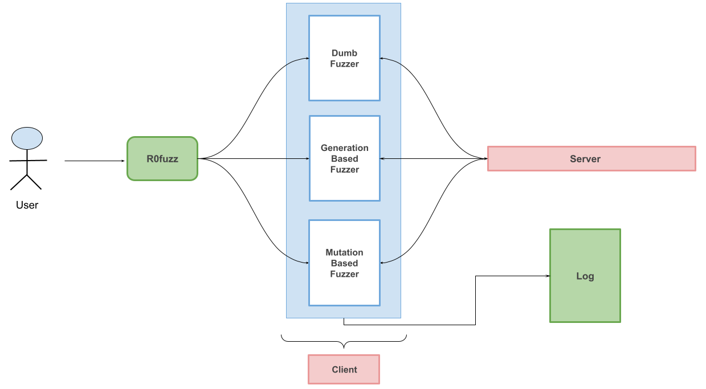

# R0fuzz <!-- omit in toc -->
[](https://github.com/AshwAthi8/Project-NetwoFuz/blob/master/LICENSE)

## Overview <!-- omit in toc -->
<p align="center">

</p>

Finding security flaws effectively and efficiently in Industrial Control Systems is of great importance as such systems are used in various important industries like nuclear power plants. *r0fuzz* aims to find security flaws in the hardware network protocols like MODBUS, DNP3 etc.

## Table of Contents <!-- omit in toc -->

- [1. Working](#1-working)
- [2. Installation](#2-installation)
- [3. Usage](#3-usage)
- [4. Features](#4-features)
- [5. TODO](#5-todo)

## 1. Working

Work flow of the tool -
 <p align="center">

</p>


## 2. Installation

Here are the installation instructions for r0fuzz

- Clone the repo
 ```shell
 git clone https://github.com/ais2397/r0fuzz.git
 cd r0fuzz
 ```
- Install the python dependencies using 

```shell
pip3 install -r requirements.txt
```

## 3. Usage
```shell
usage: r0fuzz.py [-h] -t TARGET [-v] {dumb,mutate,generate} ...

A grammar based fuzzer for SCADA protocols

positional arguments:
  {dumb,mutate,generate}
    dumb                Apply dumb fuzzing technique
    mutate              Apply mutation based fuzzing technique
    generate            Apply generation based fuzzing technique

optional arguments:
  -h, --help            show this help message and exit
  -t TARGET, --target TARGET
                        target protocol
  -v, --verbosity       Log level
```

## 4. Features
- Dumb-Fuzzing/Brute Force: Basic Fuzzer using brute force approach
- Supports smart Fuzzing approaches:
  - Generation based
- Current fuzzes:
  - MODBUS
  - DNP3


## 5. TODO:
- Implement mutation based approach
- Enhance the fuzzer experience
- Incorporate other protocols
